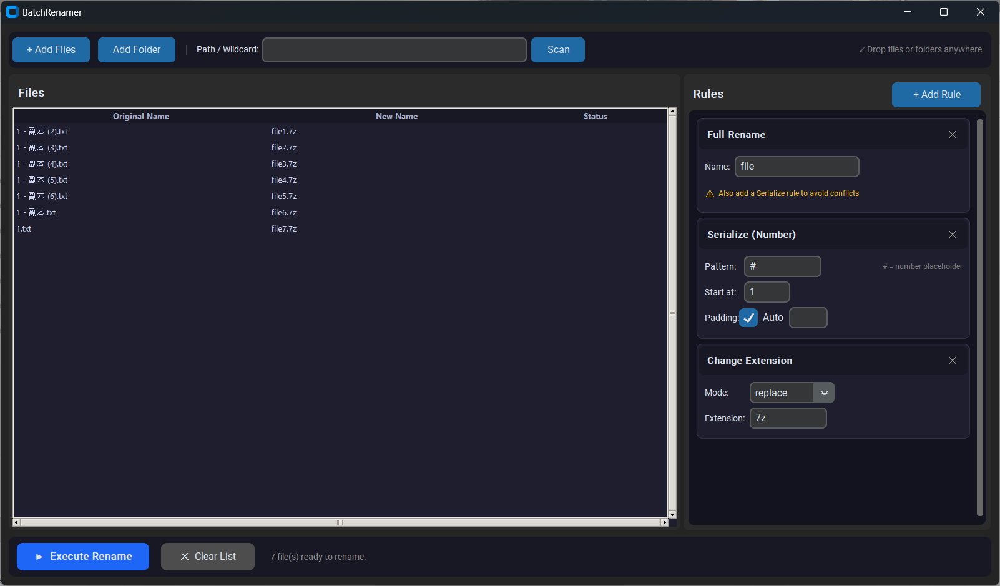

# BatchRenamer

A modern Windows desktop application for batch file renaming with multi-rule pipelines, real-time preview, and drag-and-drop support. No installation required — just download and run.



---

## Features

- **Multiple file loading methods**: dialog multi-select, folder import, wildcard scan, drag-and-drop files/folders
- **8 renaming rules** that can be combined and stacked, with real-time preview
- **Conflict detection**: duplicate new names are highlighted in red and the Execute button is disabled
- **Safe execution**: locked files are skipped with a status message — no crashes
- **Portable .exe**: no Python required, single 12 MB file

---

## Quick Start

Download `BatchRenamer.exe` from the [Releases](../../releases/latest) page, double-click to run. No installation needed.

---

## Usage

### Step 1 — Load Files

| Method | How |
|---|---|
| Dialog | Click **+ Add Files** or **Add Folder**; supports multi-select (Ctrl/Shift+click) |
| Drag & Drop | Drag files or folders directly onto the application window |
| Wildcard Scan | Enter a path pattern (e.g. `D:\Downloads\*.jpg`) and click **Scan** |

### Step 2 — Add Rename Rules

Click **+ Add Rule** in the right panel and choose a rule type. Multiple rules execute **top-to-bottom** in order.

#### Rule Reference

**Change Extension** — Replace, add, or remove file extensions.

| Mode | Description |
|---|---|
| `replace` | Replace all extensions with a specified value (e.g. `.jpg` → `.png`) |
| `add` | Add extension only to files that have none |
| `remove` | Strip the extension entirely |

---

**Serialize (Number)** — Append sequential numbers to filenames.

| Parameter | Description |
|---|---|
| Pattern | Placeholder string; `#` is replaced by the number; if absent, the number is appended |
| Start at | Starting number (default `1`) |
| Padding → Auto | Auto-determine zero-padding width based on total file count |
| Padding → Manual | Fixed digit width (e.g. `4` → `0001, 0002 …`) |

Example: Pattern `file_#` → `file_1.jpg`, `file_2.jpg` …

---

**Keep Characters** — Retain only characters from position `n` to `m` (1-based). Use `-1` for end-of-string.

**Delete Characters** — Remove characters from position `n` to `m` (1-based). Out-of-range values are clamped silently.

**Insert Text** — Insert a string at a specified position. `0` = prefix, `-1` = suffix, positive `N` = after the Nth character.

**Full Rename** — Replace every filename with a fixed value. Must be combined with **Serialize** to avoid conflicts (a warning is shown otherwise).

**Clear Chinese** — Remove all CJK unified ideograph characters from filenames.

**Delete String** — Remove all occurrences of a specified substring (case-sensitive).

---

### Step 3 — Review Preview

The **New Name** column updates in real time after every rule change.

| Color | Meaning |
|---|---|
| White | Will be renamed |
| Gray | Unchanged (new name equals old name) |
| **Red** | Conflict — fix before executing |
| Orange | Rule produced an invalid result (e.g. empty filename) |

The **Execute Rename** button is disabled while any conflict exists.

### Step 4 — Execute

Click **▶ Execute Rename**. Results appear in the Status column:

- **Done ✓** (green) — renamed successfully
- **Failed: File in use** (orange) — skipped, file was locked
- Summary shown in the status bar: `Done — X renamed, Y failed, Z skipped`

---

## Example Workflow

**Goal: Clear Chinese characters from image filenames, normalize to `.jpg`, and number them 001/002/…**

1. Drag all image files into the window
2. Add rule **Clear Chinese**
3. Add rule **Serialize** — Pattern: `#`, Start at: `1`, Padding: Auto
4. Add rule **Change Extension** — Mode: `replace`, Extension: `.jpg`
5. Confirm the preview, then click **Execute Rename**

---

## Development

| Item | Detail |
|---|---|
| Language | Python 3.11 |
| UI | CustomTkinter 5.2.x + ttk.Treeview |
| Drag & Drop | tkinterdnd2 |
| Packaging | PyInstaller 6.x |
| Platform | Windows 10 / 11 x64 |

**Run from source:**

```bash
conda activate rename
pip install -r requirements.txt
python src/main.py
```

**Rebuild .exe:**

```bash
conda activate rename
pyinstaller batch_renamer.spec
# Output: dist/BatchRenamer.exe
```

---

## Notes

- Renaming **directly modifies files on disk** — verify the preview before executing
- Back up important files before operating on them
- Wildcard scan supports standard glob syntax (`*` any chars, `?` single char, `**` recursive)

---

## TODO

- [ ] **Multi-language support** — UI localization (Chinese, Japanese, etc.)
- [ ] **Undo** — Reverse the last Execute operation to restore original filenames
- [ ] **Drag-to-reorder files** — Reorder files in the list by dragging rows; particularly useful when using the Serialize rule to control the numbering sequence
